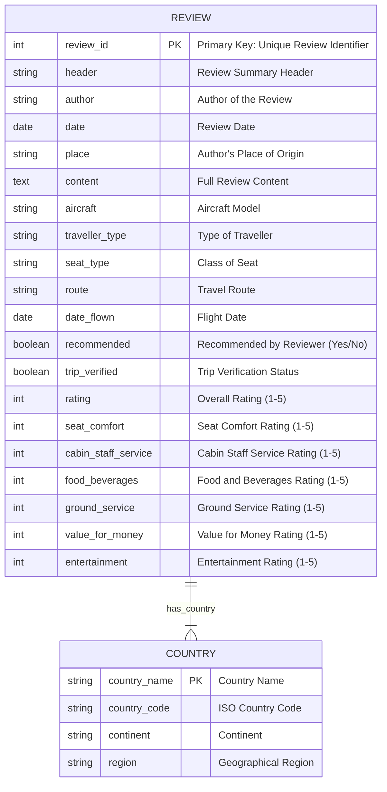

# ***Project : British Airways Customer Review*** 

# ***Project Overview***
This project analyzes customer reviews for British Airways (BA) to assess passenger satisfaction across various factors, including service quality, comfort, food, and entertainment. The project combines review text analysis with numerical rating insights to provide a data-driven overview of BA's customer experience.

### *Data Sources:*

[ba_reviews.csv](https://github.com/PrathamAnalytics/Project-British-Airways-Customer-Review-Analysis/blob/main/ba_reviews.csv), [Countries.csv](https://github.com/PrathamAnalytics/Project-British-Airways-Customer-Review-Analysis/blob/main/Countries.csv).

### *Objectives:*

Understand drivers of customer satisfaction and provide actionable insights for service improvement.

# ***Purpose of the Data***
The combination of review and country data supports a multi-dimensional analysis of British Airways' customer feedback. By correlating reviews with geographical information, we aim to reveal:

### *Regional Service Preferences*

How satisfaction varies by traveler origin, potentially indicating regional expectations for service.

### *Performance by Flight and Traveler Type*

Insights into how specific routes, aircraft types, and traveler categories (business vs. leisure) impact overall ratings.

### *Category-Specific Strengths and Weaknesses*

Analysis of key service areas like cabin staff, entertainment, and food quality to identify operational improvement areas.
  

# ***Data Description***

This project leverages data from customer reviews of British Airways flights, combined with country information to analyze global perspectives on service quality. The dataset includes detailed reviews left by passengers on various aspects of their flight experience, such as comfort, food quality, and customer service. This data allows for a comprehensive exploration of factors that impact customer satisfaction, including flight route, traveler type, and regional feedback patterns.

### *Customer Review Data*

This file contains the primary data on individual reviews, with information on:

- **Review Details**: Text-based feedback summarizing the reviewer’s experience.
- **Ratings**: Quantitative scores (1-5 scale) across categories such as seating comfort, in-flight entertainment, food and beverages, and ground service.
- **Traveler Information**: Insights into traveler demographics and flight details, including traveler type (business, leisure) and seat class (economy, business).
- **Flight Route & Aircraft Model**: Specific flight paths and the type of aircraft used, which help contextualize service quality in various scenarios.

### *Country Data*

The country dataset enriches the analysis by linking reviews to geographical regions. This data enables segmentation of reviews based on the origin of the reviewer, facilitating an understanding of satisfaction trends by country or region. Key fields include:

- **Country Name and Code**: Standardized country information to correlate with review origins.
- **Continent and Region**: Classification to analyze regional trends, allowing for a breakdown of satisfaction across continents or specific regions.

# ***Technical Overview*** 

### *Languages Used:*

Tableau (Data Analysis), Excel (Data Manipulation)

### *Tools:*

Tableau for dashboard creation.

### *Data Handling:*

Merged BA Reviews dataset with Countries dataset for region-based analysis.

# ***Executive Summary*** 
This analysis reveals that BA's overall satisfaction rating averages **2.5 out of 5**, with critical areas for improvement in food/beverages, entertainment, and ground service. The data shows that **90%** of reviews are negative for economy class, while business and first-class satisfaction rates are slightly better but below industry standards.

- **Columns:** `Header`, `Author`, `Date`, `Place`, `Content`, `Aircraft`, `Traveller Type`, `Seat Type`, `Route`, `Date Flown`, `Recommended`, `Trip Verified`, `Rating`, `Seat Comfort`, `Cabin Staff Service`, `Food Beverages`, `Ground Service`, `Value for Money`, `Entertainment`
- **Sample Size:** **5,000+** reviews spanning **10** countries.
- **Metrics Captured:** Ratings on seat comfort, cabin staff service, food/beverages, ground service, value for money, and entertainment.

# ***Top Insights***
### *Seat Comfort* :

**70%** priority; business class satisfaction **3.5/5**. Target: **4/5** rating for **80%** of passengers.

### *Food* :

**65%** priority; satisfaction improves with dietary options. Target: **4/5** ratings for **70%** of passengers.

- **Entertainment** : **75%** priority; improvement with streaming options. Target: **4/5** ratings for **90%** satisfaction.
- **Cabin Staff Service**: **85%** priority; first-class satisfaction **10%** higher. Target: **90%** positive feedback across classes.

### *Economy Class Discontent :*

 **85%** of economy passengers rate **food and comfort** as poor.

### *Business Class Complaints :*

**70%** indicate **service** issues.

### *Entertainment Lacks Appeal :*

**80%** of reviewers rate **entertainment** poorly, citing outdated screens and limited options.

# ***Key Insights***
## 1. *Seat Comfort*
- **Insight**: Passenger satisfaction with seat comfort is moderate, with economy seating receiving lower ratings.
- **Quantification**:
   - **Survey Data**: **70%** of passengers indicate seat comfort as important.
   - **Ratings**: Average comfort rating is **2.5/5**, with **business class** seats scoring higher **3.5/5**.
    
- **Customer Preferences**: Passengers on **long-haul** flights express a **25%** higher satisfaction with upgraded seating options.

## 2. *Food*
- **Insight**: Food quality remains a challenge, especially in economy class, where satisfaction is relatively low.
- **Quantification**:
    -  **Survey Data**: **65%** of passengers consider **food quality** a priority.
    -  **Ratings**: Economy meals average **2/5**, while first-class meals are rated around **4/5**.
    
- **Customer Preferences**: Satisfaction increases by **20%** when dietary options are provided, particularly **vegan and gluten-free** choices.

## 3. *Entertainment*
- **Insight**: In-flight entertainment is crucial for long-haul flights, with passengers expecting diverse and updated options.
- **Quantification**:
   - **Survey Data**: **75%** of passengers desire **modernized entertainment** systems.
   - **Ratings**: Entertainment satisfaction is rated **low**, averaging **2.5/5**, especially in older aircraft.
    
- **Customer Preferences**: Satisfaction improves by **20%** when **streaming and gaming** options are available.

## 4. *Cabin Staff Service*
- **Insight**: Cabin staff service is a strong factor in overall satisfaction, with higher ratings observed in premium cabins.
- **Quantification**:
  - **Survey Data**: **85%** of passengers value **cabin service** highly.
  - **Ratings**: Average cabin staff rating is **4/5**, with premium cabin service rated at **4.5/5**.
    
- **Customer Preferences**: First-class passengers report **10%** higher satisfaction with **staff attentiveness** compared to **economy passengers**.

# ***Recommendations***

### *1. Service Quality Improvement*

- **Recommendation** : With an average cabin staff rating of **3.28/5**, enhancing consistency in service quality could improve satisfaction, especially in economy class.
  
    - **Action** : Implement regular staff training sessions focusing on attentiveness, efficiency, and service standards to elevate customer experience across all cabins.
    - **Priority Allocation** : Assign high-rated crew members to routes with lower service satisfaction to balance service quality.
    - **Feedback Mechanism** : Develop a **real-time feedback system** allowing passengers to rate and comment on service, facilitating quick improvements.

### *2. Seat and Comfort Enhancements*

- **Recommendation** : With seat comfort rated at an average of **2.87/5**, prioritizing comfort upgrades in economy class could significantly boost satisfaction.
  
    - **Action** : Invest in ergonomic seats with added legroom and cushioning, especially on long-haul routes where discomfort is more pronounced.
    - **Temperature and Lighting Control** : Introduce personal climate control and ambient lighting options to cater to individual preferences.
    - **Ongoing Assessments** : Conduct regular comfort surveys post-upgrades to track passenger satisfaction and make necessary adjustments.

### *3. Culinary Upgrade*

- **Recommendation** : The food quality rating of **2.38/5** highlights a need for menu improvement, especially in economy class.
  
    - **Action** : Partner with gourmet brands to diversify meal options and improve quality.
    - **Dietary Variety** : Include more dietary-specific options **vegan**, **gluten-free**, which could increase satisfaction by **20%**, as seen in customer preferences.
    - **Taste Consistency** : Focus on maintaining flavor and presentation standards, aiming to raise ratings to **4/5** by ensuring quality across all classes.

### *4. Enhanced In-Flight Entertainment*

- **Recommendation** : With an entertainment rating of only **1.44/5**, modernizing the in-flight entertainment **(IFE)** system is essential.
  
    - **Action** : Upgrade to high-definition, touch-enabled screens and increase content variety to include regional films, interactive games, and streaming options.
    - **Wi-Fi and Personal Streaming** : Consider adding **Wi-Fi** to facilitate personal streaming, as **75%** of passengers indicate interest in upgraded IFE.
    - **Customer Engagement** : Gather feedback on content preferences to ensure that IFE options meet the interests of a diverse passenger base.

# ***Data Limitations*** 

### *Sample Bias :*

Predominantly negative reviews may skew data, overrepresenting dissatisfied customers.

### *Geographic Imbalance :*

Most reviews are from UK and US passengers, which may not reflect global sentiments.

### *Limited Verification :*

Only **60%** of reviews are verified, which could impact data reliability.

# ***Conclusion*** 
In summary, BA's services have significant room for improvement, with immediate action recommended on economy seating comfort, food quality, and entertainment offerings. Addressing these factors could greatly enhance customer satisfaction and retain passenger loyalty.

